---
title "Sample Data Handling"
---

# Sample Data Handling

```mermaid
flowchart TD
 LocalRun[🧔LocalRun] -->|Upload Sample Data| DataReceptionAPI
 CloudRun -->|Upload Sample Data| DataReceptionAPI
 
 DataReceptionAPI -->|Temporary Save To| Redis
 Redis -->|LambdaTransferTask| S3TransferFiles 
 
 S3TransferFiles -->|LambdaMergeTask|S3MergeFiles

 User[🧔User] -->|Subscribe|WebSocketHandler
 Redis -->|Query|WebSocketHandler
 S3TransferFiles --> |Query|WebSocketHandler
 S3MergeFiles --> |Query|WebSocketHandler
 DataReceptionAPI -->|DjangoChannel|WebSocketHandler
 WebSocketHandler -->|SubscribedData|User
```

## Collecting

When the model is running, it generates sampling data. We collect this data by
customizing Julia's Logger. The collected sampling data is sent to the data
reception API. To avoid performance issues caused by frequent API calls, a
rate-limiting logic is applied when sending sampling data: data is sent at
intervals no less than 1 second. This minimum interval can be modified through
an environment variable and defaults to 1 second.

## Transfer

After the data reception API receives the data, it temporarily stores it in
Redis cache to improve interface performance. Since Redis stores data in memory,
it cannot handle too high a volume of data. Therefore, after each data storage
to Redis, we check the memory usage of Redis. When the actual memory usage
exceeds a certain proportion of the maximum available, a Lambda task is
initiated to transfer the Redis cache data to S3 files. We use a distributed
lock to ensure that only one instance of this Lambda task runs at a time.
During the transfer, we first rename the Redis key where the data is stored,
read the data from the renamed key, and then delete the renamed key after the
transfer is complete, ensuring that data can continue to be written without
duplication or loss during the transfer process.

## Query

The API that receives data also sends the received data to the Django channel,
so that our websocket handler receives notifications. If a user subscribes to
data from a certain variable, the newly generated data is sent to that user,
achieving real-time data notification. In fact, when a user subscribes to a
variable, that variable may have already accumulated a considerable amount of
data. According to the above data processing process, variable data may exist
in Redis cache or in S3 transfer files, and in fact, may also be stored in S3
merged files, which we will mention later. Therefore, when a user subscribes to
a variable, we query data from multiple sources and send the merged data to the
user as the basis for real-time data. To ensure reading efficiency, all these
data storages are stored by variable units, making it more efficient for us to
obtain data through variables. The downside is the need to manage a large
number of keys or files.

## Merge

If the model generates a large amount of sampling data, it may lead to multiple
transfers of Redis data to S3, resulting in a large number of transfer files.
Too many files may slow down the query for variable data subscribed by users.
Therefore, after the model finishes running, we run a Lambda task to transfer
the remaining Redis data again and merge multiple transfer files of the same
variable into one. This processing occurs after the model has finished running,
and users are not aware of it.

