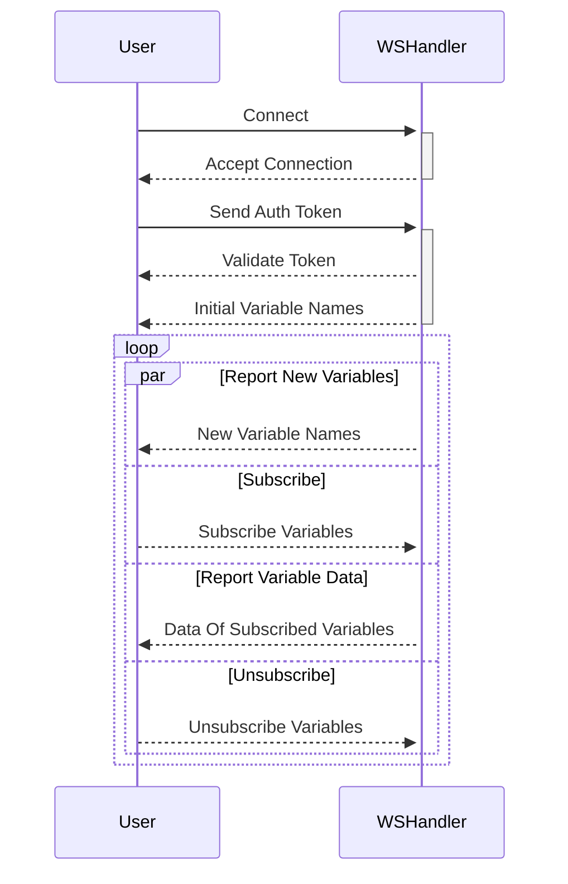

# Coinfer Cloud WebSocket

## The problem

The old API to get experiment data always returns the whole data, thus having performance problems.

So we are going to make some changes. The general approach is to only return the data the user is interested in.

The client need to subscribe to some variables. Only after that the server will return the data of these variables. By default no data will be returned.

## The workflow



1. client make WebSocket connection, server accept the connection. client do auth, server validate the auth.
2. when auth validation passes, server send out the initial variable names (the names collected until now)
3. as the experiment continues, server will continuously collect new variables. When it found some variable names not sent to the client, it sends out the new variable names
4. at the same time, the client may subscribe to some variables
5. when the server receives a subscription to a variable, it first sends out the initial sample data of this variable. And then the server will remember the subscription and will continuously send out sample data of the subscription when experiment running.
6. the client may also unsubscribe to a variable. In this case the server will just forget the subscription, so no sample data about this variable will be send out anymore. If the client wants to subscribe the variable later, the same process in [4,5] will happen.

## Message Format

### Auth

```js
{"action": "authorization", "token": "<token>", "version": "1.0"}
```

### Send out variable names

the server send out the known variable names after connection established and when new variables are collected

```js
{
    "action": "names",
    "data": [
        {
            "chain": "chain-name",
            "names": ["extra/acceptance_rate/stat/Mean", "extras/acceptance_rate/val"]
        }
    ]
}
```

### Subscribe

client send out type=="subscribe" when user want to see the data of a variable.

```js
{
    "action": "subscribe",
    "data": [
        {
            "chain": "chain-name",
            "variables": ["extra/acceptance_rate/stat/Mean", "extras/acceptance_rate/val"]
        }
    ]
}
```

### Unsubscribe

client send out type=="unsubscribe" when user no longer interested in a variable

```js
{
    "action": "unsubscribe",
    "data": [
        {
            "chain": "chain-name",
            "variables": ["extra/acceptance_rate/stat/Mean", "extras/acceptance_rate/val"]
        }
    ]
}
```

### Log Data

```js
{
    "message": {
        "action": "experiment:output",
        "data": "<log text including line returns>"
    }
}
```

## Variable Data

the format used both in initial data and incremental data

```js
{
    "action": "experiment:event",
    "data": [
        {
            "chain": "chain-name",
            "data": {
                "extra/acceptance_rate/stat/Mean": [1.0, 2.0],
                "foobar": [{},, {}],
            }
        }
    ]
}
```

# Examples

Let’s use a simple python script to demonstrate these protocols.

```python
import json
from websockets.sync.client import connect

ws_root = "wss://dev.coinfer.ai"
token = "<your-token>"
xid = "<an-experiment-ID>"

msg_auth = {"action": "authorization", "token": token, "version": "1.0"}

msg_sub = {
    "action": "subscribe",
    "data": [
        {
            "chain": "chain_default",
            "variables": ["extras/acceptance_rate/stat/Mean", "extras/acceptance_rate/stat/Variance"],
        }
    ],
}

msg_unsub = {
    "action": "unsubscribe",
    "data": [{"chain": "chain_default", "variables": ["extras/acceptance_rate/stat/Mean"]}],
}

auth_header = {"Authorization": f"Bearer {token}"}
with connect(f"{ws_root}/mcmc/ws/sub/object/{xid}") as websocket:
    websocket.send(json.dumps(msg_auth))  # send the auth message
    message = websocket.recv()  # receive the logs data
    print(f"output> {message}")
    message = websocket.recv()  # receive the initial variable names
    print(f"names> {message}")

    websocket.send(json.dumps(msg_sub))  # subscribe variables
    message = websocket.recv()
    print(f"sub> {message}")  # receive the subscribed variables data

    websocket.send(json.dumps(msg_unsub))  # unsubscribe variable
```

1. The script starts by importing necessary modules - `json`,  and `connect` from `websockets.sync.client`.
2. Sets up a few variables:
    1. `ws_root` : the WebSocket root URL
    2. `token` : the authentication token
    3. `xid` : an experiment identifier.
3. Defines several JSON messages:
    1. `msg_auth` for authentication
    2. `msg_sub` for subscribing to certain variables
    3. `msg_unsub` for unsubscribing from certain variables.
4. The script then opens a WebSocket connection to the server using the `connect` function, with the URL constructed by combining `ws_root` and `xid`.
5. After the connection is established, the script sends the authentication message (`msg_auth`) to the server using the `send` function.
6. It then receives messages from the server using the `recv` function. The first message received should be the log data, and the second message should be the initial variable names. Both messages are printed to the console.
7. The script then sends the subscription message (`msg_sub`) to the server, to subscribe to certain variables. The server's response message should contain the data of the subscribed variables, which is then printed to the console.
8. Finally, the script sends the unsubscription message (`msg_unsub`) to the server, to unsubscribe from certain variables.

The real message returned from the server may contain a lot of data. I’ll simplify them a little for demonstration purposes:

```js
// ========================= log data =========================
{
    "message": {
        "action": "experiment:output",
        "data": "Resolving package versions...\n   Installed Glob "
    }
}

// ========================= initial variable names =========================
{
    "message": {
        "action": "names",
        "data": [
            {
                "chain": "chain_default",
                "names": [
                    "extras/acceptance_rate/stat/Mean",
                    "extras/acceptance_rate/stat/Variance"
                ]
            }
        ]
    }
}

// ========================= variable data =========================
{
    "message": {
        "action": "experiment:event",
        "data": [
            {
                "chain": "chain_default",
                "data": {
                    "extras/acceptance_rate/stat/Mean": [
                        1,
                        0.8227303723102763,
                        0.6508580670310302
                    ]
                }
            }
        ]
    }
}
```
